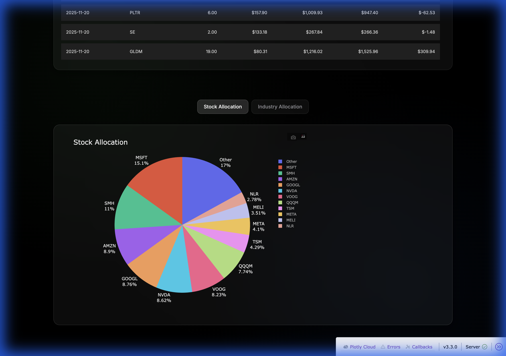

# 💎 Glassmorphism Financial Dashboard

A premium, automated investment tracking suite designed with an **Apple-style Glassmorphism aesthetic**. This dashboard provides deep insights into your portfolio performance across Individual, ESPP, and 401k accounts, featuring automated data ingestion and advanced financial metrics.



## 🚀 Key Features

### 1. Automated Fidelity Scraper 🤖
- **Zero Manual Effort**: Uses **Playwright** to automatically log in to Fidelity and download the latest transaction history.
- **Smart Sync**: Dynamically detects the last download date to only fetch missing data, ensuring a continuous and accurate timeline.
- **Robust Parsing**: Handles complex CSV formats, including Microsoft ESPP credits and 401k contribution structures.

### 2. Advanced Analytics & Metrics 📈
- **Personal Return (XIRR)**: Calculates the true internal rate of return, accounting for the timing of all cash flows.
- **Portfolio Return (TWR)**: Time-Weighted Return to isolate investment performance from the effects of cash inflows/outflows.
- **P/L Insight**: Tracks both **Realized P/L** (from sales) and **Unrealized P/L** (current market values).
- **Segmentation**: Deep dive into Individual + ESPP, 401k, or a Combined view of your entire net worth.

### 3. Apple-Style Design System ✨
- **Glassmorphism**: Semi-transparent cards with `backdrop-filter` blur, thin borders, and abstract gradient backgrounds.
- **Premium Typography**: Built with the **Inter** typeface for maximum readability and a high-end feel.
- **Responsive Layout**: Designed for a clean, centered experience that scales beautifully.
- **Sleek Tables**: Replaced standard grid lines with modern Bootstrap-based glass tables and scrollable history views.

### 4. Allocation & Industry Deep Dives Sector
- **Live Market Data**: Integrated with **yfinance** to fetch real-time sector and industry data.
- **Visual Allocation**: Interactive pie charts showing your exposure by stock and industry, with automatic "Other" grouping for small positions.

## 🛠 Tech Stack

- **Frontend**: Dash (Plotly), Dash Bootstrap Components (DBC).
- **Backend Data**: Pandas, NumPy.
- **Automation**: Playwright (Python).
- **Market Data**: yfinance API.
- **Styling**: Vanilla CSS (Custom Glassmorphism engine).

## 📥 Setup & Usage

### 1. Installation
```bash
# Clone the repository
git clone https://github.com/tushar2407/financial-dashboard.git
cd financial-dashboard

# Set up virtual environment
python3 -m venv venv
source venv/bin/bin/activate  # Mac/Linux

# Install dependencies
pip install -r requirements.txt
```

### 2. Auto-Fetch Data
```bash
# Run the scraper to get the latest Fidelity data
# Handle MFA manually in the browser window if prompted
python fetch_data.py
```

### 3. Launch Dashboard
```bash
# Start the Dash server
python src/app.py
```
Visit `http://127.0.0.1:8050` in your browser.

---
*Created with ❤️ for premium financial tracking.*