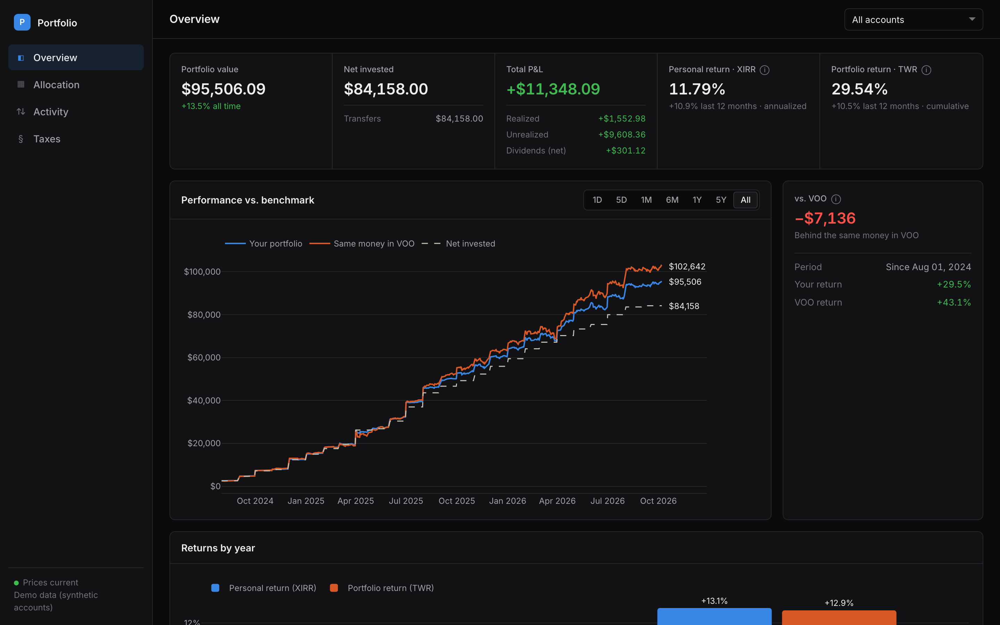
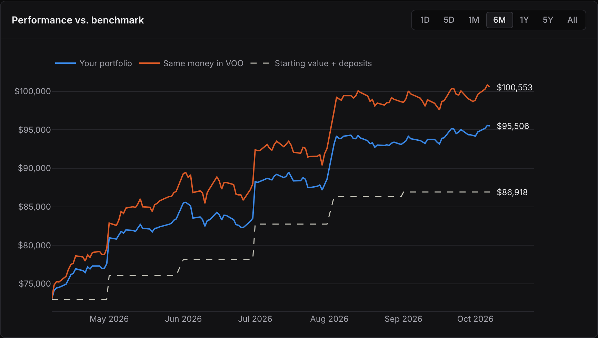
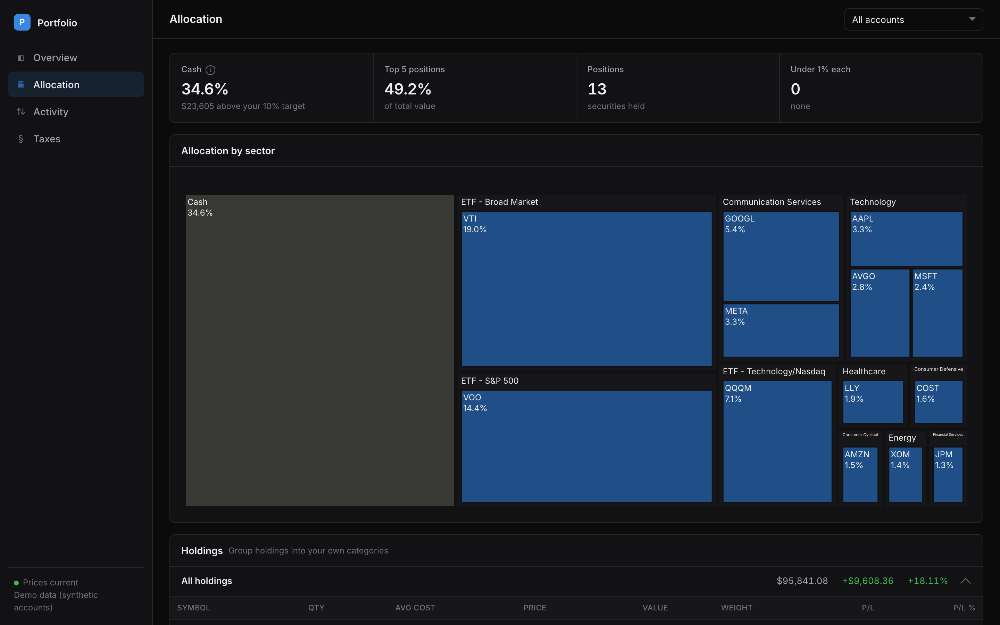
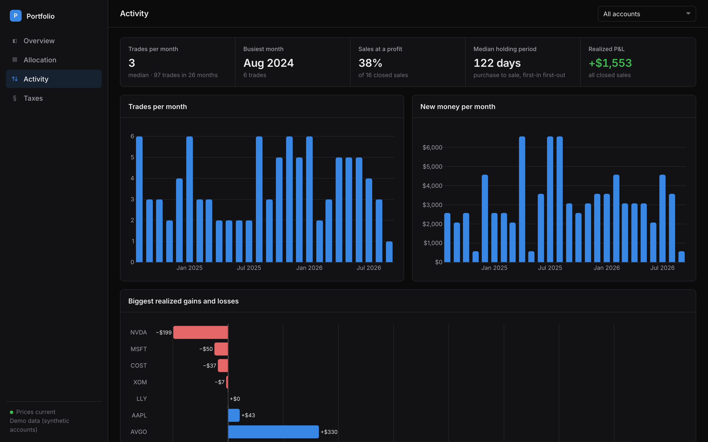
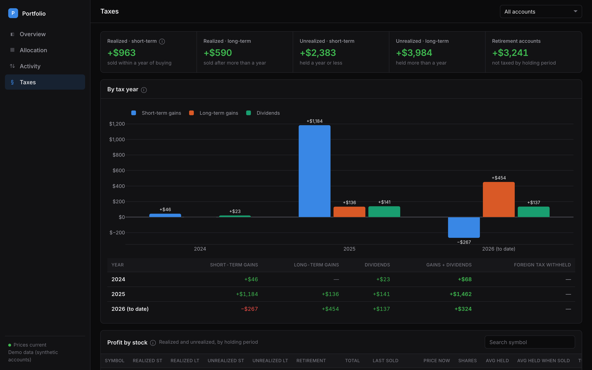
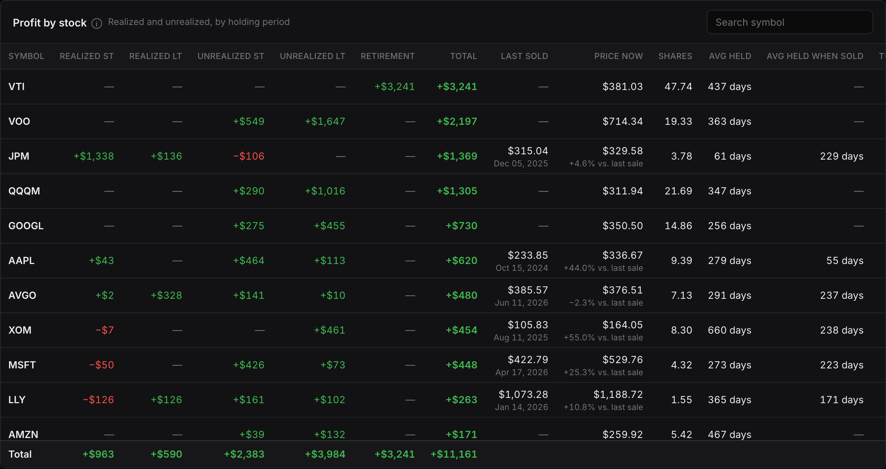
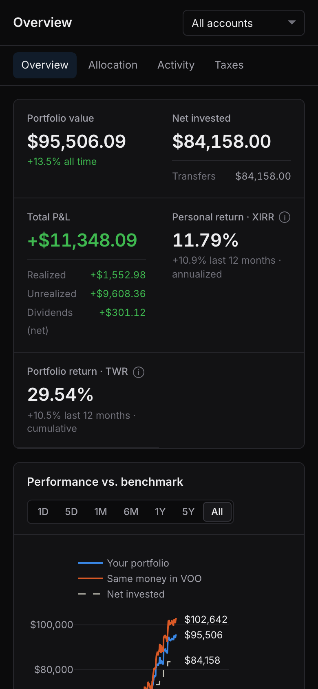
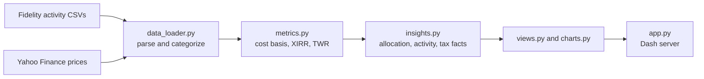

<div align="center">


# Portfolio

**A self-hosted investment dashboard for Fidelity accounts.**
Performance, allocation, trading activity and tax figures, rebuilt from your own
transaction history and kept entirely on your machine.

[](https://github.com/tushar2407/financial-dashboard/actions/workflows/tests.yml)
[](LICENSE)


[Features](#features) ·
[Quick start](#quick-start) ·
[Use with Fidelity](#use-it-with-your-fidelity-accounts) ·
[How it works](#how-the-numbers-are-computed) ·
[Roadmap](#roadmap) ·
[Contributing](#contributing)



<sub>All screenshots use the bundled synthetic demo data.</sub>

</div>

## Why

Brokerage websites show balances, not answers. They won't tell you whether your
stock picks beat simply buying the index with the same deposits, how much of
this year's gains are short-term, or when your shares turn long-term.
Portfolio downloads your Fidelity activity history, rebuilds every position and
tax lot from it, and answers those questions in one place. Nothing is sent to a
server, and there's no account to create.

## Features

### Overview: are you beating the market?



- Portfolio value, net invested and total P&L, split into realized,
  unrealized and dividends.
- **Personal return (XIRR)**, which counts when you added money, and
  **portfolio return (TWR)**, which doesn't.
- Your portfolio against the **same deposits invested in a benchmark** (VOO
  by default) on the same days, over 1D, 5D, 1M, 6M, 1Y, 5Y or all time.
- Returns by calendar year.

### Allocation: what do you actually own?



- Cash against your target, the weight of your five largest positions, and
  positions under 1% of the portfolio.
- A sector map of every holding, and a holdings table you can group into your
  own categories.

### Activity: how do you trade?



- Trades and new money per month, share of sales at a profit, and median
  holding period.
- Biggest realized gains and losses by stock.
- Every closed trade, filterable by year and searchable, with its tax term.

### Taxes: what will you owe?



- Short- and long-term gains, dividends and foreign tax withheld for each tax
  year, for taxable accounts only.
- **Profit by stock**: realized and unrealized gains split by holding period,
  your last sale price against today's price, average holding period, and the
  date your next shares turn long-term.



### Built for daily use

<table>
<tr>
<td width="62%" valign="top">

- **Multiple accounts.** Every account in the export is discovered
  automatically. Filter to one account, all brokerage accounts, all retirement
  accounts, or everything.
- **Retirement aware.** 401k, IRA and BrokerageLink accounts are kept apart
  from taxable ones. Money moved between your own accounts is never counted
  as new money.
- **Fresh by default.** Starting the app fetches new activity if your data
  isn't from today.
- **Honest numbers.** If a holding has no recent market price, the app tells
  you instead of silently using an old one.
- **Tables you can work with.** Sticky headers, search, and multi-column
  sorting (Shift+click a header to add a sort level).
- **Works on a phone.**

</td>
<td width="38%" valign="top">

</td>
</tr>
</table>

## Quick start

Requires Python 3.11+ and Google Chrome.

```bash
git clone https://github.com/tushar2407/financial-dashboard.git
cd financial-dashboard
python3 -m venv venv
source venv/bin/activate
pip install -r requirements.txt

python src/app.py --demo
```

Open http://127.0.0.1:8050. Demo mode reads only `data/demo/`, a synthetic
history for two made-up accounts, and never contacts Fidelity. To regenerate
the demo data, run `python scripts/make_demo_data.py`.

## Use it with your Fidelity accounts

```bash
python src/app.py
```

1. If your data isn't from today, a Chrome window opens on Fidelity's login
   page.
2. Sign in and complete MFA yourself. The app never sees or stores your
   password.
3. The app downloads your activity history into `data/` and then starts the
   dashboard.

| Command | What it does |
|---|---|
| `python src/app.py` | Fetch if needed, then start the dashboard |
| `python src/app.py --no-fetch` | Start with the data you already have |
| `python src/app.py --demo` | Start on synthetic demo data |
| `python fetch_data.py` | Run only the fetch |

Press Ctrl+C during a fetch to skip it and start with your existing data.

### Settings

Optional settings live in `data/goals.json`:

```json
{ "cash_target": 0.10, "benchmark": "VOO" }
```

| Key | Default | Meaning |
|---|---|---|
| `cash_target` | `0.10` | Cash share the Allocation page measures you against |
| `benchmark` | `VOO` | Ticker your portfolio is compared with |

## Privacy and security

- **Your data stays on your machine.** There is no server, telemetry or
  account.
- **Personal files are never committed.** `data/` (exports, settings,
  caches) and `.fidelity_session/` (the saved browser login) are git-ignored.
  Only the synthetic files in `data/demo/` are part of the repository.
- **Outbound requests:** Fidelity (only during a fetch you start) and Yahoo
  Finance (for public prices, by ticker symbol only).
- **Sharing a bug report?** Reproduce it with `--demo` rather than attaching
  your own data.

## How the numbers are computed

<details>
<summary><b>Positions and cost basis</b></summary>

Positions are rebuilt from the full transaction history. Sales are matched to
purchases first-in, first-out within each account, Fidelity's default.
Retirement plan contributions are new money; purchases inside an account
funded by a transfer are not. Withdrawals that return to the same account
within 10 days are treated as round trips, not withdrawals.
</details>

<details>
<summary><b>Prices</b></summary>

Prices come from Yahoo Finance and are not split-adjusted, so they line up
with the share counts Fidelity recorded at the time. Dividends are tracked as
cash, not folded into prices.
</details>

<details>
<summary><b>XIRR, TWR and the benchmark</b></summary>

- **XIRR** is the annualized return on your actual cash flows, so it counts
  when you added money.
- **TWR** chains daily returns, so the size and timing of deposits don't
  affect it. A deposit made on a weekend or holiday counts on the next
  trading day.
- **Benchmark:** for any time range, the benchmark line starts with your
  portfolio's value on the first day of the range, then buys or sells the
  benchmark on each day you deposited or withdrew money.
</details>

<details>
<summary><b>Tax figures</b></summary>

A gain is long-term when the shares were held more than one year. The tax-year
view covers taxable accounts only, and counts reinvested dividends as income.
These are estimates: wash sales are not adjusted, and ESPP cost basis is the
purchase price. Your 1099 is authoritative.
</details>

## Architecture


```mermaid
flowchart LR
    F[Fidelity activity CSVs] --> L[data_loader.py<br/>parse and categorize]
    Y[Yahoo Finance prices] --> L
    L --> M[metrics.py<br/>cost basis, XIRR, TWR]
    M --> I[insights.py<br/>allocation, activity, tax facts]
    I --> V[views.py and charts.py]
    V --> A[app.py<br/>Dash server]
```

```
src/
  app.py              Dash app: loads data, wires callbacks
  layout.py           Sidebar, top bar, routing
  views.py            Overview, Allocation, Activity, Taxes pages
  components.py       Panels, KPI strip, data tables
  charts.py           Plotly figures
  formatting.py       Money, percent, share and date formatting
  data_loader.py      CSV parsing, transaction categories, prices, sectors
  metrics.py          Cost basis, cash flows, XIRR and TWR
  insights.py         Derived facts for each page
  fidelity_scraper.py Browser-driven Fidelity download
scripts/make_demo_data.py  Synthetic demo data
tests/                     Test suite (run by CI)
```

## Roadmap

- [ ] Carry the original purchase date and cost through stock splits
- [ ] Group the allocation map by your own categories instead of sector
- [ ] Manual prices for funds Yahoo Finance doesn't carry (some 401k funds)
- [ ] AI reflection on your investing patterns, measured against your own goals
- [ ] Support for brokers other than Fidelity

## Contributing

Contributions are welcome. See [CONTRIBUTING.md](CONTRIBUTING.md) for setup,
the test workflow, and the one hard rule: never include real financial data in
issues, pull requests or tests.

```bash
for t in tests/test_*.py; do python "$t" || break; done
```

## License

[MIT](LICENSE)

## Disclaimer

Portfolio is not affiliated with, endorsed by, or connected to Fidelity
Investments. It is not financial or tax advice. Figures are estimates derived
from your transaction history; verify anything important against your
brokerage statements and tax forms.
